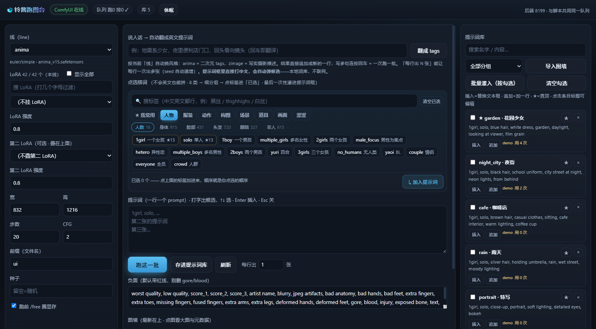

# 铃酱跑图台 · Suzu-chan Painter

一个 ComfyUI 的薄前端 —— **不会写英文提示词，也能把图拼出来。**

纯 Python 标准库，零依赖；前端是单文件 HTML，跑在本机浏览器里。



## 它能干什么

- **中文标签点选** —— 本地 danbooru 中文词库（3 万词），8 个大类 → 细分组 → 点标签进「已选」→ 一键拼成提示词。提示词框里直接打中文也会弹候选。
- **说人话 → 提示词** —— 中文描述交给 LLM 翻成 danbooru tag 串（写实线则是摄影描述）。可选功能，不配也能用。
- **批量跑图** —— 一行一个 prompt，每行可出 N 张（seed 自动递增，不会出一堆一样的）。
- **提示词库** —— 存 / 搜 / 分组 / ★置顶，也能从图墙反查导入。
- **图墙** —— 看结果、读 PNG 元数据、一键载入某张图的全部参数。
- **ComfyUI 按需开关** —— 不跑图不占显存，要用再唤醒。

## 快速开始

**前提**：Python 3.11+（只用标准库）；一个能跑的 ComfyUI（默认 `http://127.0.0.1:8188`）。

```bash
git clone https://github.com/trigger94666-max/suzu-chan-painter.git
cd suzu-chan-painter
```

### 1. 配路径

复制 `config.example.json` 为 `config.json`，改成你自己的：

```json
{
  "port": 8199,
  "comfy_url": "http://127.0.0.1:8188",
  "output_dir": "C:/ComfyUI/output",
  "download_dir": "C:/ComfyUI/output",
  "tag_dir": "./knowledge/danbooru-tags-zh"
}
```

| 字段 | 说明 |
|---|---|
| `comfy_url` | ComfyUI 地址 |
| `output_dir` | 出图目录（ComfyUI 的 output） |
| `download_dir` | 另一个要显示在图墙的目录，没有就填成一样 |
| `tag_dir` | 中文词库目录（下一步会下到这里） |
| `comfy_dir` / `comfy_log` | ComfyUI 安装目录 / 日志路径 —— 只有要用「重启 ComfyUI」才需要 |
| `proxy` | 访问境外 LLM 端点用的代理，留空则不走 |
| `prompt_help` | 提示词助手配置。`endpoint` 填**任何 OpenAI 兼容**的 chat/completions 地址即可，`key_env` 是存放 key 的环境变量名；不用就把 `enabled` 设 `false` |

相对路径一律相对**项目根目录**。环境变量可临时覆盖（见 `config.py` 的 `ENV_MAP`）。

### 2. 下词库

```bash
python fetch_tags.py                          # 需要代理时加 --proxy http://127.0.0.1:7890
```

数据来自 [amenorira/danbooru-tags-data-zh](https://github.com/amenorira/danbooru-tags-data-zh)（MIT），**不随仓库分发**，由这个脚本拉到你本机。

### 3. 起

```bash
python server.py
```

Windows 也可以双击 `start.bat`。然后打开 **http://127.0.0.1:8199**。

## 「线」是什么

一条**线** = 一套「模型 + CLIP/VAE + 采样参数 + 默认负面词」的组合，定义在 `comfy_batch.py` 的 `LINES` 里。

仓库自带的几条线**只是示例**，`unet` / `clip` / `vae` 要换成你自己 ComfyUI 里有的文件名：

```python
LINES = {
    "mymodel": dict(unet="你的模型.safetensors", unet_node="UNETLoader",
                    clip="qwen_3_06b_base.safetensors", clip_type="qwen_image",
                    vae="qwen_image_vae.safetensors", pos_node="CLIPTextEncode",
                    steps=20, cfg=2.0, sampler="euler", scheduler="simple",
                    width=832, height=1216, neg=NEG_COMBO),
}
```

LoRA 想显示中文别名，写在自己 `config.json` 的 `lora_meta` 段里（格式 `文件名: [线, 别名, 是否星标]`）；不写就靠文件名规则自动归线。

## HTTP API

给脚本 / agent 用，和网页共用同一个队列：

```
POST /api/run
{"line":"anima","prefix":"mybatch","jobs":[{"suffix":"a","prompt":"1girl, solo","seed":123}]}
```

跑图台会按需唤醒 ComfyUI、跑完释放显存、产物进图墙。

## 文件结构

```
server.py            后端（标准库 http.server，零依赖）
index.html           单文件前端（原生 JS，无框架无 CDN）
tagcats.py           标签分类规则（8 大类 → 23 个二级组）—— 改分类只动这个文件
comfy_batch.py       线定义 + ComfyUI 节点图构建
config.py            配置加载（默认值 < config.json < 环境变量）
config.example.json  配置模板
fetch_tags.py        中文词库下载脚本
start.bat / stop.bat Windows 启动/停止
```

## 许可

MIT，见 `LICENSE`。

中文词库数据来自 [amenorira/danbooru-tags-data-zh](https://github.com/amenorira/danbooru-tags-data-zh)（MIT），由 `fetch_tags.py` 下载，不随本仓库分发。

## 免责声明

本工具是**中性工具**：它只负责提示词组织与任务提交，本身不生成、不存储、不传播任何内容；
出图由你自己本机运行的模型完成，结果全部留在你自己的机器上。

使用者须自行确保使用方式符合所在地法律法规，作者不承担因使用本工具产生的任何责任。
